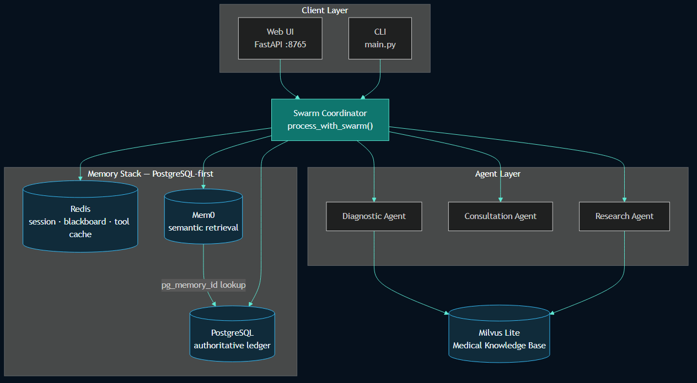
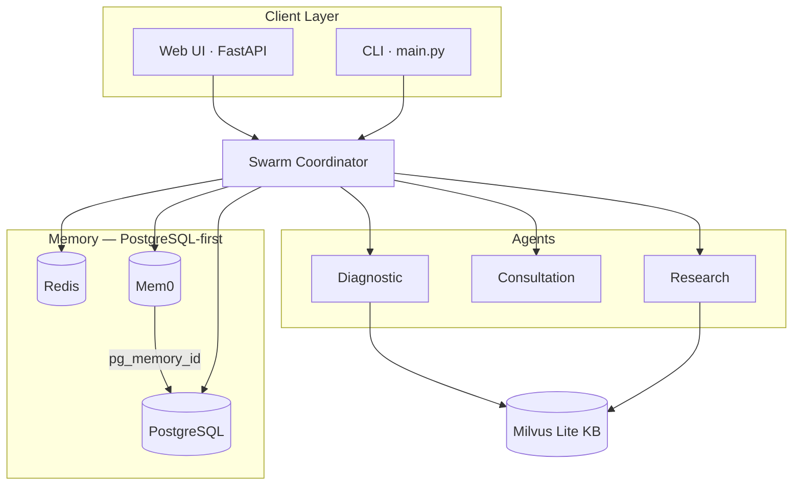

# MediX Multi-Agent Medical Assistant

> A multi-agent medical consultation system with clinical reasoning, retrieval-augmented knowledge, and a production-style memory stack built on **Redis + PostgreSQL + Mem0**.


MediX is designed as a serious medical assistant prototype rather than a simple chatbot. It combines a Swarm-style multi-agent workflow, clinical knowledge retrieval, structured memory, privacy filtering, tool caching, and a polished medical Web UI.

> Disclaimer: this project is for learning, research, and portfolio demonstration. It does not replace professional medical diagnosis or treatment.

## Architecture

> GitHub **does not render SVG** inside README (security policy), so the diagram below uses **PNG**. Source files: `docs/assets/medix-architecture.mmd` (editable) and `medix-architecture.svg` (design export).



<details>
<summary>Mermaid source (click to expand — also renders on GitHub)</summary>



</details>

The core design principle is **PostgreSQL-first memory**:

```text
User question
  -> short-term context from Redis
  -> similar historical cases from Mem0
  -> authoritative content lookup from PostgreSQL
  -> Swarm / single-agent reasoning
  -> privacy filtering
  -> PostgreSQL insert
  -> optional Mem0 semantic sync
```

## Why This Project Stands Out

- **Multi-agent medical reasoning**: a coordinator can route work to diagnostic, consultation, and research-style agents instead of relying on one monolithic prompt.
- **Three-layer memory architecture**: Redis handles active sessions and tool cache, PostgreSQL acts as the auditable long-term source of truth, and Mem0 provides cross-session semantic recall.
- **PostgreSQL-first persistence**: semantic memory does not own the full record; Mem0 stores retrieval metadata and links back to PG via `pg_memory_id`.
- **Knowledge-augmented answers**: Milvus Lite powers local medical knowledge search for lifestyle guidance, emergency symptoms, ICD-style references, and clinical guideline snippets.
- **Modern Web UI**: FastAPI serves a glassmorphism-style medical chat interface with animated ECG background, spinner, thinking dots, Markdown rendering, and Swarm mode toggle.
- **Observability tooling**: scripts let you inspect Redis sessions, PostgreSQL records, and Mem0 search behavior from one place.
- **Security-aware configuration**: real secrets are excluded from Git; `config.example.py` documents the expected local setup.

## Repository Layout

```text
.
├── config.example.py                  # Safe template; copy to config.py locally
├── README.md
├── docs/
│   └── assets/
│       ├── medix-architecture.png      # README diagram (GitHub-safe)
│       ├── medix-architecture.mmd      # Mermaid source
│       └── medix-architecture.svg      # SVG export (not shown in README)
├── medix-agent-swarm/
│   ├── api/server.py                   # FastAPI backend for Web UI
│   ├── web/                            # HTML/CSS/JS medical chat interface
│   ├── main.py                         # CLI interactive assistant
│   ├── swarm/                          # Coordinator, lead agent, shared context
│   ├── agents/                         # Medical agent implementations
│   ├── core/                           # Agent loop, LLM client, skill loading
│   ├── memory/                         # Redis / PostgreSQL / Mem0 stack
│   ├── knowledge/                      # Milvus Lite knowledge base
│   ├── scripts/                        # Environment and memory inspection tools
│   ├── docs/MEMORY_GUIDE.md            # Detailed memory system guide
│   └── docker-compose.memory.yml       # Redis + PostgreSQL services
└── MediX-R1/                           # Training / evaluation related code
```

## Core Components

### 1. Swarm Coordinator

`medix-agent-swarm/swarm/swarm_coordinator.py` is the main orchestrator. It enriches incoming questions with recent short-term memory, searches long-term semantic memory, decides whether to use single-agent or multi-agent flow, and writes the final result back to memory.

### 2. Memory Stack

The memory stack is initialized through `get_memory_stack()` and keeps all components aligned:

| Layer | Role | Examples |
|------|------|----------|
| Redis | Hot runtime state | current session messages, Swarm blackboard, tool cache |
| PostgreSQL | Authoritative ledger | full Q&A records, memory IDs, summaries, audit-ready storage |
| Mem0 | Semantic retrieval layer | cross-session similar cases, meaning-based recall |

### 3. Knowledge Base

Milvus Lite stores local medical reference documents. Skills such as `search-knowledge`, `clinical-guideline`, `recommend-lifestyle`, and `search-similar-cases` can support answers with domain-specific context.

### 4. Web Interface

The Web UI uses FastAPI plus static HTML/CSS/JS. It is intentionally lightweight while still feeling like a clinical product interface:

- animated medical background
- professional dark theme
- assistant typing / thinking state
- quick prompt chips
- Markdown answer rendering
- session ID display
- Swarm mode toggle

## Quick Start

### 1. Clone

```bash
git clone https://github.com/terrense/medical-multi_agent-project.git
cd medical-multi_agent-project
```

### 2. Configure Secrets

Create a local config file from the safe template:

```bash
cp config.example.py config.py
```

On Windows PowerShell:

```powershell
Copy-Item config.example.py config.py
```

Then fill in your local API keys:

```python
LLM_CONFIG = {
    "api_key": "your-deepseek-or-openai-api-key",
    "model_name": "deepseek-chat",
    "base_url": "https://api.deepseek.com/v1",
}

MEM0_CONFIG = {
    "api_key": "your-mem0-api-key",
}
```

`config.py` is intentionally ignored by Git.

### 3. Install Dependencies

```bash
cd medix-agent-swarm
pip install -r requirements.txt
```

### 4. Start Memory Services

```bash
docker compose -f docker-compose.memory.yml up -d
```

This starts:

- Redis for short-term memory and tool cache
- PostgreSQL for authoritative long-term memory

### 5. Run the CLI Assistant

```bash
python main.py
```

### 6. Run the Web UI

```bash
python api/server.py
```

Open:

```text
http://127.0.0.1:8765
```

## Observing the Memory System

MediX includes scripts for inspecting what is actually stored in each layer.

List active and recent sessions:

```bash
python scripts/observe_memory.py --list
```

Inspect one session:

```bash
python scripts/observe_memory.py 20260516-002309-fff364c5
```

Verify environment connectivity:

```bash
python scripts/verify_memory_env.py
```

For a full explanation of Redis, PostgreSQL, Mem0, and the exact read/write path, see:

```text
medix-agent-swarm/docs/MEMORY_GUIDE.md
```

## Example Use Cases

- Ask common medical questions with safety reminders.
- Discuss chronic disease management such as hypertension or diabetes.
- Retrieve similar historical cases from previous sessions.
- Demonstrate multi-agent orchestration in a healthcare context.
- Inspect memory behavior across Redis, PostgreSQL, and Mem0.
- Present a polished AI healthcare assistant prototype in a resume or portfolio.

## Technical Highlights

| Area | Implementation |
|------|----------------|
| Orchestration | Swarm coordinator with optional multi-agent execution |
| LLM Access | OpenAI-compatible client, tested with DeepSeek-style config |
| Short-Term Memory | Redis-backed session history |
| Long-Term Memory | PostgreSQL-first persistence with Mem0 semantic sync |
| Knowledge Retrieval | Milvus Lite local vector search |
| Tool Cache | Redis-backed tool result cache |
| UI | FastAPI + static HTML/CSS/JS |
| Observability | `observe_memory.py`, direct Redis / PG inspection |
| Privacy | PII filtering and confidence scoring before memory sync |

## Security Notes

- Do not commit `config.py`, `.env`, API keys, or database credentials.
- `config.example.py` is safe to commit because it contains placeholders only.
- Session summaries and local runtime memory can contain user health text; keep them out of public commits unless intentionally anonymized.

## Demo Video

MediX Web UI · multi-agent workflow · memory recall.

https://cdn.jsdelivr.net/gh/terrense/medical-multi_agent-project@main/docs/assets/medix-demo.mp4

## Roadmap Ideas

- Stream token-by-token responses in the Web UI.
- Add authenticated user profiles and per-user memory namespaces.
- Add structured clinical intake forms before free-text chat.
- Add citation panels for retrieved guideline snippets.
- Add Docker Compose profile for one-command full-stack startup.
- Add tests around memory write / recall / privacy filtering.

## License

This repository is currently intended for personal research, learning, and portfolio demonstration. Add a license before using it in production or distributing it broadly.
