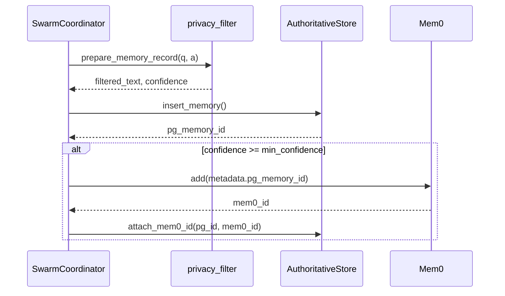
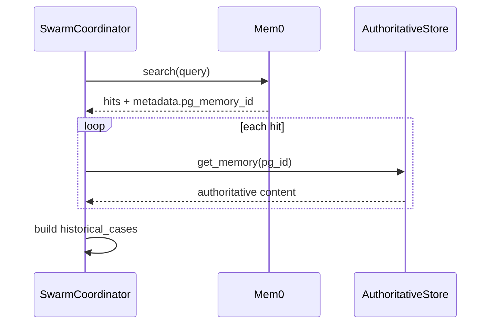

# Medix 记忆系统学习指南

本文档说明 **Redis + PostgreSQL + Mem0** 三层记忆架构、各模块职责，以及从用户提问到记忆落库的完整调用链。

---

## 1. 架构总览

```
┌─────────────────────────────────────────────────────────────────┐
│                     SwarmCoordinator.process()                   │
└───────────────────────────────┬─────────────────────────────────┘
                                │
        ┌───────────────────────┼───────────────────────┐
        ▼                       ▼                       ▼
 ┌─────────────┐        ┌──────────────┐        ┌─────────────┐
 │   Redis     │        │ PostgreSQL   │        │    Mem0     │
 │  热数据层    │        │  权威账本     │        │  语义索引层  │
 └─────────────┘        └──────────────┘        └─────────────┘
```

| 组件 | 职责 | 主要 Key / 表 |
|------|------|----------------|
| **Redis** | 当前会话多轮对话、Swarm blackboard、工具结果缓存 | `medix:session:*`, `medix:blackboard:*`, `medix:tool:*` |
| **PostgreSQL** | 长期记忆权威存储、会话摘要、审计、软删 | `memories`, `session_summaries`, `audit_logs`, `user_consents` |
| **Mem0** | 向量语义召回、跨会话补全；携带 `pg_memory_id` 元数据 | Mem0 Cloud API |

**核心原则：PostgreSQL-first**

长期记忆写入顺序：

```
隐私过滤 → 置信度评估 → INSERT PostgreSQL →（置信度达标）同步 Mem0 → 回写 mem0_id
```

读取顺序：

```
用户问题 → Mem0.search() → 用 metadata.pg_memory_id 回查 PG → 返回权威 content
```

---

## 2. 目录与文件职责

```
medix-agent-swarm/memory/
├── settings.py              # 从 config.py / 环境变量加载配置
├── memory_stack.py          # 单例：统一初始化三层组件 ★入口
├── redis_store.py           # Redis 连接 + session/blackboard/tool 三类 API
├── short_term.py            # 短期记忆（会话消息）
├── authoritative_store.py   # PostgreSQL 账本
├── long_term.py             # PG-first + Mem0 长期记忆
├── privacy_filter.py        # PII 脱敏 + 置信度
├── tool_cache.py            # 工具调用缓存封装
├── session_summary.py       # Swarm 会话总结（PG + Markdown）
├── entropy_manager.py       # 去重/压缩（Harness Engineering）
└── agent_identity.py        # Agent 身份本地 Markdown（与三层记忆独立）

swarm/
├── swarm_coordinator.py     # 记忆检索/保存的总 orchestrator
└── shared_context.py        # Swarm blackboard（可持久化到 Redis）

core/
└── agent_loop.py            # 写短期记忆 + 读工具缓存

.claude/skills/
├── search-history/          # 读短期记忆（当前会话）
└── search-similar-cases/    # 读长期记忆（跨会话）
```

项目根目录 `config.py`：

```python
REDIS_CONFIG / POSTGRES_CONFIG / MEM0_CONFIG / MEMORY_CONFIG
```

---

## 3. 单例入口：`get_memory_stack()`

**所有新代码应通过此处获取记忆组件**，避免 `ShortTermMemory(storage_type="memory")` 与协调器使用不同实例。

```python
from memory import get_memory_stack

stack = get_memory_stack()
stack.short_term_memory   # ShortTermMemory
stack.long_term_memory    # LongTermMemory
stack.redis_store         # RedisStore
stack.authoritative_store # AuthoritativeStore
stack.tool_cache          # ToolCallCache
```

`MemoryStack.__init__` 逻辑（`memory/memory_stack.py`）：

1. `get_redis_store()` → 探测 Redis
2. `get_authoritative_store()` → 探测 PostgreSQL 并 `CREATE TABLE IF NOT EXISTS`
3. `short_term_storage` 配置为 `redis` 且 Redis 可用 → `ShortTermMemory(storage_type="redis")`，否则降级 `memory`
4. `LongTermMemory(authoritative_store=...)`

---

## 4. 完整调用链

### 4.1 用户提问 → 上下文增强（读路径）

```
main.py / API
  └─► SwarmCoordinator.process(question, session_id)
        │
        ├─► short_term_memory.get_recent_messages(session_id, limit=10)
        │     └─► ShortTermMemory.get_session()
        │           ├─ memory: self.sessions[session_id]
        │           └─ redis: RedisStore.load_session() → ConversationHistory
        │     └─► entropy_manager.auto_clean()  # 可选去重压缩
        │
        ├─► long_term_memory.search_similar_sessions(query, limit=3)
        │     └─► mem0.search(user_id, query)
        │     └─► 每条结果：若有 pg_memory_id → pg.get_memory(pg_id) 覆盖 content
        │
        ├─► enhanced_context["recent_history"] = ...
        ├─► enhanced_context["historical_cases"] = ...  # 含 pg_memory_id, confidence
        │
        └─► LeadAgent.assess_and_decompose(question, enhanced_context)
              └─► 单 Agent 或 Swarm 分支
```

### 4.2 单 Agent 模式（写路径）

```
ConsultationAgent.process(input_data)
  └─► BaseAgent.run_loop(input_data)
        └─► AgentLoop.run(agent, input_data, session_id)
              │
              ├─► _initialize_messages()
              │     └─► short_term_memory.get_history(session_id)  # 加载历史进 LLM messages
              │
              ├─► short_term_memory.add_message(session_id, "user", ...)
              │
              ├─► [循环] llm_client.chat_with_tools()
              │     ├─► _execute_tool_with_cache()
              │     │     ├─► tool_cache.get(tool, args)  → Redis HIT 则跳过执行
              │     │     ├─► agent.execute_tool() → skill_registry.execute()
              │     │     └─► tool_cache.set(tool, args, result)
              │     └─► short_term_memory.add_message("assistant" / "tool", ...)
              │
              └─► 返回 final_answer

SwarmCoordinator.process()  # 非 Swarm 分支结尾
  └─► long_term_memory.add_session_summary(session_id, question, answer, metadata)
        ├─► prepare_memory_record()      # privacy_filter.py
        ├─► pg.insert_memory()           # authoritative_store.py
        ├─► if confidence >= min: mem0.add(metadata={pg_memory_id})
        └─► pg.attach_mem0_id(pg_id, mem0_id)
```

### 4.3 Swarm 模式（blackboard + 写路径）

```
SwarmCoordinator._process_with_swarm()
  │
  ├─► SharedContext(session_id, redis_store)   # 可从 Redis hydrate
  │
  ├─► LeadAgent.create_subtasks() → shared_context.add_subtask()
  │     └─► persist_to_redis()  # blackboard 快照
  │
  ├─► Worker AgentLoop（同上，共享 short_term_memory + tool_cache）
  │
  ├─► shared_context.complete_subtask() → persist_to_redis()
  │
  ├─► LeadAgent.synthesize_results(shared_context)
  │
  ├─► SessionSummary.from_shared_context()
  ├─► session_manager.save_summary()
  │     ├─► 写 Markdown 文件
  │     └─► pg.save_session_summary_row()
  │
  ├─► long_term_memory.add_session_summary()   # PG-first（同 4.2）
  └─► shared_context.persist_to_redis()        # 最终 blackboard 快照
```

### 4.4 Skill 侧读记忆

| Skill | 脚本 | 调用 |
|-------|------|------|
| 当前会话历史 | `search-history/script/search.py` | `get_memory_stack().short_term_memory.get_recent_messages()` |
| 相似历史案例 | `search-similar-cases/script/search.py` | `get_memory_stack().long_term_memory.search_similar_sessions()` |

---

## 5. 核心类 API 速查

### 5.1 `RedisStore` (`redis_store.py`)

| 方法 | 说明 |
|------|------|
| `save_session(session_id, dict)` | 短期对话 JSON，TTL 默认 3600s |
| `load_session(session_id)` | 加载会话 |
| `save_blackboard(session_id, snapshot)` | Swarm 黑板快照 |
| `load_blackboard(session_id)` | 恢复黑板 |
| `get_tool_cache` / `set_tool_cache` | SHA256(tool+args) 作 key |

### 5.2 `ShortTermMemory` (`short_term.py`)

| 方法 | 说明 |
|------|------|
| `create_session(session_id)` | 创建会话 |
| `add_message(session_id, role, content)` | 追加消息 |
| `get_recent_messages(session_id, limit)` | 最近 N 条（含熵清理） |
| `get_history(session_id, limit)` | OpenAI 格式，仅 user/assistant |
| `clear_session(session_id)` | 清空 |

单例模式：多次 `ShortTermMemory()` 返回同一实例；`get_memory_stack()` 首次注入 `redis_store`。

### 5.3 `AuthoritativeStore` (`authoritative_store.py`)

| 方法 | 说明 |
|------|------|
| `insert_memory(...)` | 写入 `memories` 表，写审计日志，返回 UUID |
| `attach_mem0_id(pg_id, mem0_id)` | 关联 Mem0 |
| `get_memory(pg_id)` | 权威单条查询 |
| `get_memory_by_mem0_id(mem0_id)` | 反向查询 |
| `soft_delete_memory(pg_id)` | 软删 + 审计 |
| `save_session_summary_row(...)` | Swarm 摘要入 PG |

### 5.4 `LongTermMemory` (`long_term.py`)

| 方法 | 说明 |
|------|------|
| `add_session_summary(session_id, question, answer, metadata)` | **PG-first 写入**，返回 `pg_memory_id` |
| `search_similar_sessions(query, limit)` | Mem0 召回 + PG 回查 |
| `delete_memory(pg_memory_id)` | 软删账本 |

### 5.5 `SharedContext` (`shared_context.py`)

| 方法 | 说明 |
|------|------|
| `add_subtask` / `complete_subtask` | 任务黑板 |
| `get_contributions` | Agent 贡献 |
| `to_snapshot` / `persist_to_redis` | Redis 持久化 |
| `_hydrate_from_snapshot` | 启动时恢复 |

### 5.6 `privacy_filter.py`

| 函数 | 说明 |
|------|------|
| `filter_pii(text)` | 手机/身份证/邮箱脱敏 |
| `assess_confidence(question, answer, metadata)` | 0~1 启发式分数 |
| `prepare_memory_record(...)` | 组合上述，供 PG 写入 |

---

## 6. 数据流图（Mermaid）

### 写入



### 读取



---

## 7. 配置与启动

### 7.1 启动依赖

```bash
cd medix-agent-swarm
docker compose -f docker-compose.memory.yml up -d
pip install -r requirements.txt
```

### 7.2 `config.py` 示例

```python
MEM0_CONFIG = {"api_key": "m0-xxx"}
REDIS_CONFIG = {"host": "localhost", "port": 6379, "db": 0}
POSTGRES_CONFIG = {
    "host": "localhost", "port": 5432,
    "database": "medix_memory", "user": "medix", "password": "medix",
}
MEMORY_CONFIG = {
    "short_term_storage": "redis",
    "min_confidence_for_sync": 0.3,
}
```

### 7.3 优雅降级

| 不可用 | 行为 |
|--------|------|
| Redis | 短期记忆 → 内存；blackboard/tool cache 关闭 |
| PostgreSQL | 长期记忆仅 Mem0（无 `pg_memory_id` 回链） |
| Mem0 | 长期记忆仅 PG（无语义召回） |
| 三者皆无 | 仅当次会话内存对话，无跨会话记忆 |

### 7.3.1 Web 聊天界面

```powershell
conda activate medix-swarm
cd "E:\居丽叶简历项目7：医疗助手\medix-agent-swarm"
docker compose -f docker-compose.memory.yml up -d
pip install fastapi uvicorn
python api/server.py
```

浏览器打开 **http://127.0.0.1:8765**。界面含医学风格主题、思考动画（转圈 + 三点）、Markdown 回答渲染；后端复用 `process_with_swarm`，与 `main.py` 共用同一 `session_id` 记忆链路。

### 7.4 推荐最小观察流程（约 10 分钟）

**准备：** 两个终端均可；终端 A 跑 `main.py`，终端 B 跑观察脚本。

```powershell
conda activate medix-swarm
cd "E:\居丽叶简历项目7：医疗助手\medix-agent-swarm"
docker compose -f docker-compose.memory.yml up -d
```

| 步骤 | 终端 | 操作 | 验证点 |
|------|------|------|--------|
| 1 | A | `python main.py -v` | 日志出现 `Memory: redis=True, pg=True, mem0=True` |
| 2 | A | 问「高血压」→ 追问「饮食上少吃什么」（同一次不 exit） | 日志 `Loaded N recent messages from short-term` |
| 3 | A | `exit` 后重开 `main.py`，问「有类似案例吗」 | 日志 `Long-term search` / `Found similar historical` |
| 4 | B | `python scripts/observe_memory.py <session_id>` | 见下文「输出解读」 |
| 5 | B | 可选：`python scripts/observe_memory.py --list` | 列出所有 session |

从终端 A 日志复制 `session_id`，例如：

```text
Processing question (session=20260516-002309-fff364c5)
```

### 7.5 观察脚本 `scripts/observe_memory.py`（推荐）

**不必新开特殊终端**，但与正在运行的 `main.py` 分开一个窗口更清晰（避免日志刷屏）。

```powershell
conda activate medix-swarm
cd "E:\居丽叶简历项目7：医疗助手\medix-agent-swarm"

# 列出最近 session（Redis keys + PG 分组统计）
python scripts/observe_memory.py --list

# 查看某个 session 的三方快照
python scripts/observe_memory.py 20260516-002309-fff364c5

# 指定 Mem0 试探查询（演示语义召回）
python scripts/observe_memory.py 20260516-002309-fff364c5 --query "高血压 类似案例"
```

脚本输出三块：**1. Redis** → **2. PostgreSQL** → **3. Mem0**，末尾有对照说明。

### 7.6 手工查看 Redis / PostgreSQL（步骤 4、5 备选）

与脚本等价，适合面试时演示「亲手进库」。

**PostgreSQL（步骤 4）**

```powershell
cd "E:\居丽叶简历项目7：医疗助手\medix-agent-swarm"

# 进入交互式 psql
docker compose -f docker-compose.memory.yml exec postgres psql -U medix -d medix_memory
```

在 `medix_memory=#` 提示符下执行：

```sql
SELECT id, session_id, left(content, 80) AS preview, mem0_id, confidence, created_at
FROM memories
WHERE is_deleted = FALSE
ORDER BY created_at DESC
LIMIT 5;
```

退出：`\q`

一条命令版（不进入 psql）：

```powershell
docker compose -f docker-compose.memory.yml exec postgres psql -U medix -d medix_memory -c "SELECT id, session_id, left(content,60), mem0_id, created_at FROM memories WHERE is_deleted=FALSE ORDER BY created_at DESC LIMIT 5;"
```

**Redis（步骤 5）**

```powershell
# 列出所有短期会话 key
docker compose -f docker-compose.memory.yml exec redis redis-cli KEYS "medix:session:*"

# 查看某个 session 的 JSON（把 id 换成你的）
docker compose -f docker-compose.memory.yml exec redis redis-cli GET "medix:session:20260516-002309-fff364c5"
```

其他 key 空间：

| 前缀 | 含义 |
|------|------|
| `medix:session:*` | 短期多轮对话 |
| `medix:blackboard:*` | Swarm 协作黑板 |
| `medix:tool:*` | 工具调用缓存 |

### 7.7 `observe_memory.py` 输出解读（对照你的实测）

#### `--list` 模式

```text
当前 session keys (3):          ← Redis 里还有 3 次 main.py 会话的短期记忆（未过期）
blackboard keys: 1              ← 至少跑过 1 次 Swarm
tool cache keys: 10             ← 缓存过 10 次工具结果

最近有记忆的 session（Top 10）:  ← PG 按 session 统计写入条数
  20260516-002309-fff364c5  (2 条, ...)
  20260516-001742-9d9ab923  (6 条, ...)
```

- **Redis 有 3 个 session、PG 有记录** → 三层记忆都在工作。
- **PG 条数 > Redis session 数** 正常：每次用户一问一答会在 PG 写 1 条，Redis 按 session 合并多轮。

#### 指定 `session_id` 模式

**区块 1 Redis**

- `短期消息数: 4`：当前 session 在 Redis 里存了 4 条消息（含 user/assistant/tool）。
- 内容里出现 `[系统信息]... historical_cases` / `recent_history`：Agent 注入的上下文也被记入短期记忆（正常现象，但会让 JSON 变大）。
- `blackboard: 无`：该 session 走单 Agent，未走 Swarm。

**区块 2 PostgreSQL**

```text
memories 表: 2 条
  pg_id=...  mem0_id=02a962f7-...  conf=0.75   ← PG 与 Mem0 已关联（双写成功）
```

- 每轮用户问答结束通常 **+1 条** `memories` 行。
- `mem0_id` 非空 → Mem0 同步成功（修复 metadata 超限后应稳定出现）。

**区块 3 Mem0**

```text
试探查询: 高血压 生活方式
命中 session_id=20260516-001742-9d9ab923   ← 不一定是当前 session！
source=pg+mem0                              ← 先 Mem0 召回，再 PG 取权威正文
```

- Mem0 按**语义**找相似，不按 session_id 精确查库。
- 你查 `fff364c5` 却命中 `9d9ab923`，说明「高血压/饮食」相关内容在另一次会话里——这正是跨会话长期记忆。

#### `redis-cli GET` 看到的一大段 JSON

- 即 `ConversationHistory` 序列化结果；`\xe7\x94\xa8` 等为 UTF-8 中文的转义显示，不是乱码。
- 消息越多、注入的 `recent_history` 越长，GET 输出越长（短期记忆膨胀，后续可优化为只存纯净 user/assistant 文本）。

---

## 8. 与 Milvus 知识库的区别

| | 记忆系统 | `knowledge/milvus_kb.py` |
|--|----------|---------------------------|
| 内容 | 用户对话、病例摘要 | 医学指南、ICD 文档 |
| 存储 | Redis/PG/Mem0 | Milvus 向量库 |
| 触发 | 每轮对话自动 | Skill `search-knowledge` 显式检索 |

**不要在简历里把 Milvus 和 Mem0 都写成「长期记忆」。**

---

## 9. 建议阅读顺序（学代码）

1. `config.py` + `memory/settings.py` — 看清配置从哪来  
2. `memory/memory_stack.py` — 单例组装  
3. `swarm/swarm_coordinator.py` 的 `process()` — 读/写总线  
4. `memory/long_term.py` — PG-first 核心  
5. `memory/short_term.py` + `core/agent_loop.py` — 会话内循环  
6. `swarm/shared_context.py` — Swarm 黑板  
7. `memory/authoritative_store.py` — 表结构与审计  
8. Skills：`search-history`、`search-similar-cases`  
9. 观察工具：`scripts/observe_memory.py`、`scripts/verify_memory_env.py`（见 §7.4–7.7）

---

## 10. 简历一句话（可直接用）

> 记忆分层采用 Redis + PostgreSQL + Mem0：Redis 承载会话多轮上下文、Swarm blackboard 与工具缓存；**PostgreSQL 作为长期记忆的权威持久化账本**；**Mem0 作为语义索引与 Agent 记忆服务层**。写入采用 PostgreSQL-first，经隐私过滤与置信度评估后同步 Mem0 并携带 `pg_memory_id`，保证语义检索可审计回溯。

---

## 11. 改动文件清单（本次实现）

- 新增：`memory/settings.py`, `redis_store.py`, `authoritative_store.py`, `privacy_filter.py`, `tool_cache.py`, `memory_stack.py`
- 重构：`memory/long_term.py`, `memory/short_term.py`, `memory/__init__.py`, `memory/session_summary.py`
- 串联：`swarm/swarm_coordinator.py`, `swarm/shared_context.py`, `core/agent_loop.py`
- Skills：`search-history`, `search-similar-cases`
- 运维：`docker-compose.memory.yml`, 根目录 `config.py`, `requirements.txt`
- 观察：`scripts/observe_memory.py`, `scripts/verify_memory_env.py`
